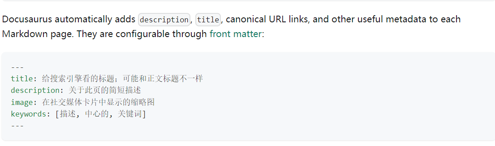
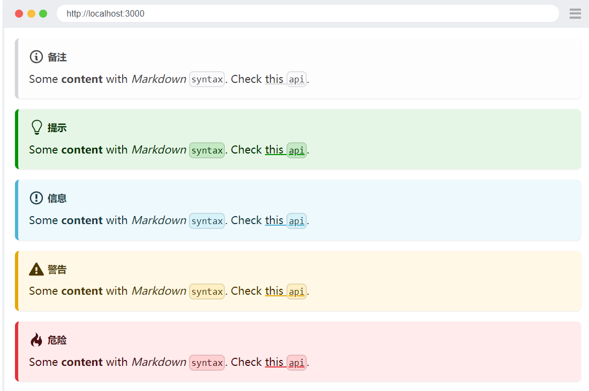
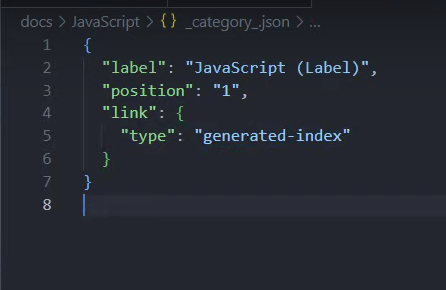

# Docusaurus 学习笔记

[官方文档](https://docusaurus.io/zh-CN/)

视频资料来源：[weiwei 前端教学](https://www.youtube.com/watch?v=NpoaHl380DM&list=WL&index=2&t=1222s)

在此，我向作者致敬！salute

---

## 一、安装 Docusaurus

我会出一份小白适用的教学笔记，打算发布在[小红书](https://www.xiaohongshu.com) 平台上。（也算是给自己挖个坑哈）

## 二、关于 Docusaurus 的基本知识

- Docusaurus 是使用 React 来开发的。我们需要以 Markdown 的格式来撰写文档 & 博客，docusaurus会帮助生成静态网站。这其中涉及几个专业名词，如React、Markdown、静态网站。React我不懂，Markdown将写一篇笔记进行介绍。
- 使用 Algolia 工具，可以实现网站的全局搜索
- 一个 # 后面是本文的标题，从两个 # 开始数，才是一级标题、二级标题、三级标题……
- 

## 三、新建文档

1. 

[搜索引擎优化 | 官方文档](https://docusaurus.io/zh-CN/docs/seo)    在页面的顶部，可以给本文档添加描述，如下所示：

2. 

[Markdown 提示 | 官方文档](https://docusaurus.io/zh-CN/docs/markdown-features/admonitions)  在写作的过程中，我们可以采用这种形式(在网站上会显示，但是Markdown预览不会看到效果)

:::danger

I am because you are !

:::

## 四、新建文件夹

你新建一个文件夹，如果里面什么都没有的话，在网站是默认不显示的。这时候，你需要添加文件进去

### 1、_category_.json 文件

可以规定文件夹的标签、位置并制作目录。经本人实验，完全可用！

## 五、新建项目

src 文件夹 ➡️ pages 文件夹

可以新建一个 Markdown 文件 ，也可以新建一个 JS 文件

:::warning

建立可重复使用的components ？ 我不太懂哎

:::

## 六、docusaurus.config（样式的设定）

- title：My site
- tagline：Dinosaurs are cool
- favicon: 'img/favicon.ico'

这个部分，是设定网站的标题、首页宣言以及图标，可以自行设定

- broken links 无效链接问题，可能会出现在网站部署环节

:::note

在 intro 页面，建一个网站目录，是可以实现滴！（视频的第27分钟）

:::

- i18n 网站的语言，默认是英语（en），可以改成简体中文（zh），繁体中文（zh-Hant）

- 网站颜色主题的切换：

themeconfig 部分，程序语言不会写，就先不放了

- 设定公告栏  announcementbar

- ctrl + I ，可以看提示，themeconfig哪些还可以调整

### (一)移除“编辑此页”

在 docusaurus.config.js 文件中，presets部分，将 “editurl” 删除就行 （本人没有这个需求）

### （二）修改 vercel 部署成功后的URL

[我的网站](https://my-website-eight-lilac.vercel.app/) 

在 docusaurus.config.js 文件中，开头部分，将 URL 替换成vercel部署生成的 URL

这会影响你的 /sitemap.xml     我也不太懂捏 :(

